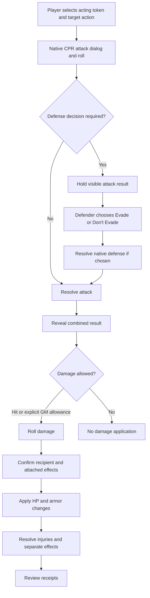
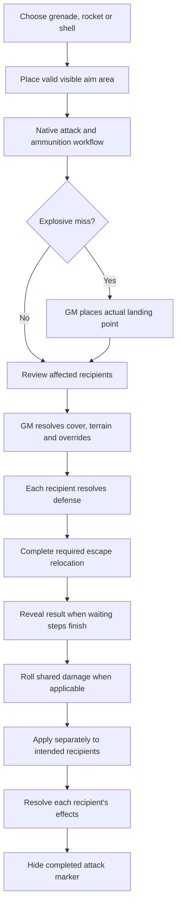
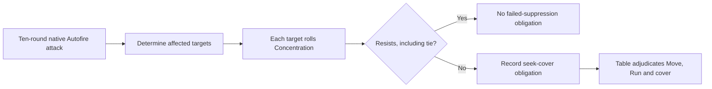
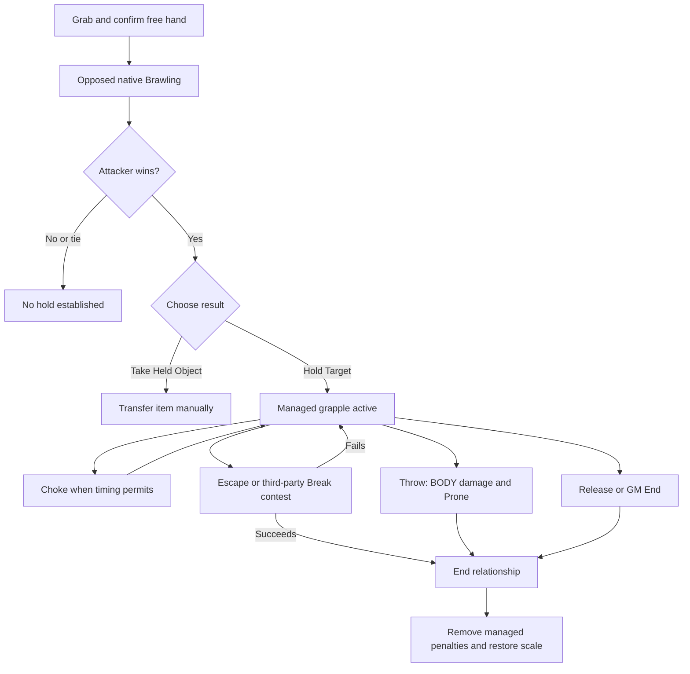
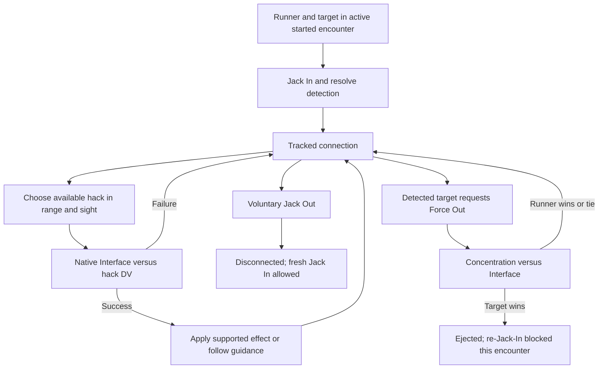
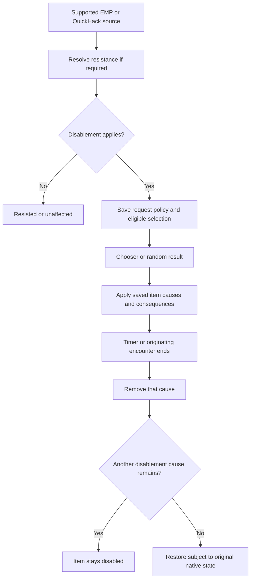
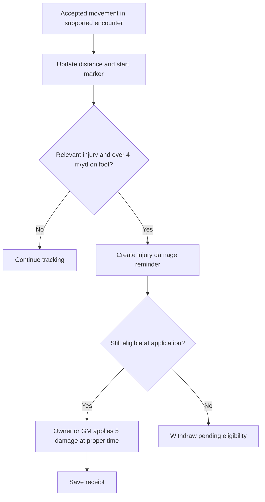
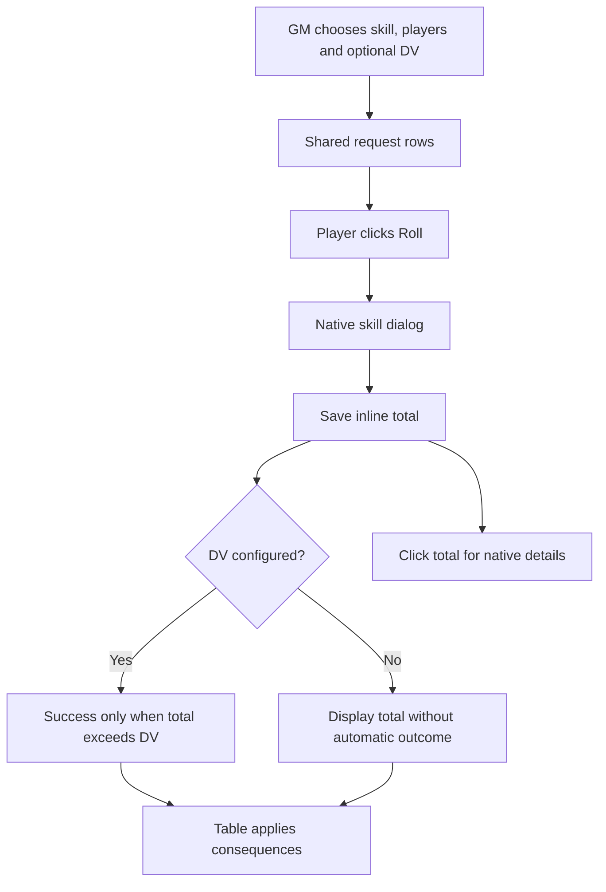
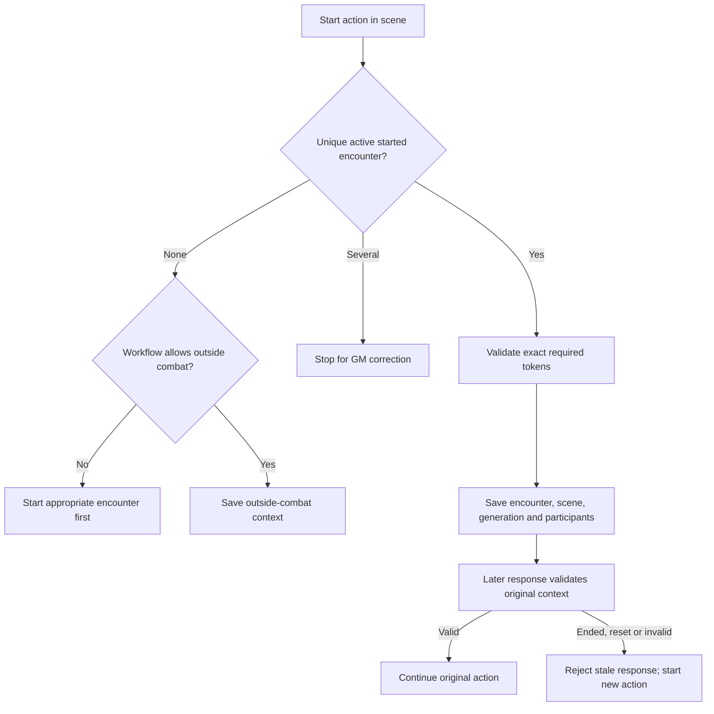
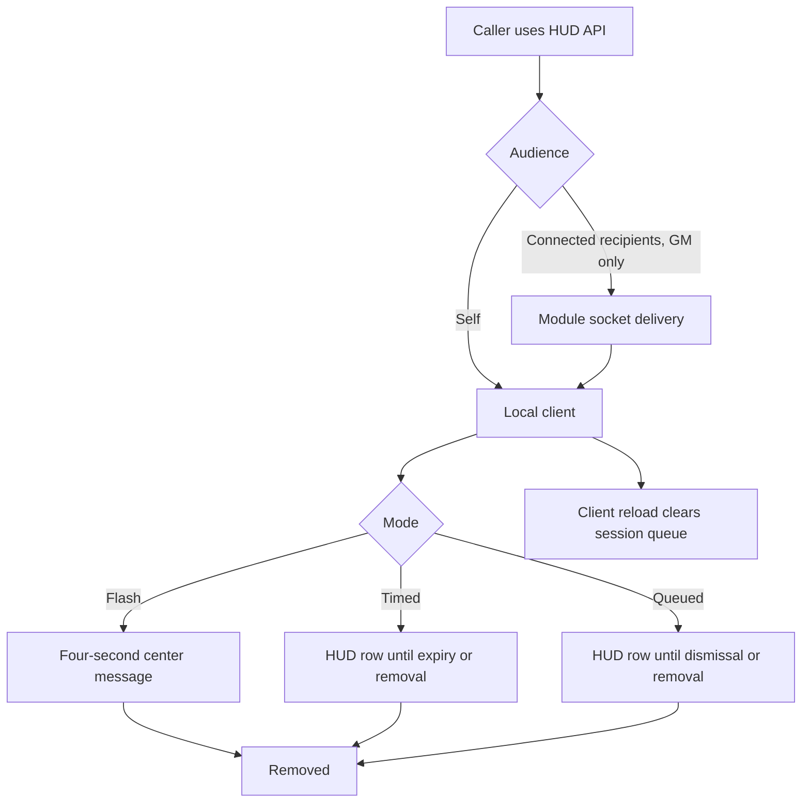

# Combat Mermaids

Mermaid workflow diagrams for Obsidian Reading view. Each diagram shows decisions and handoffs; it does not imply every branch happens on every attack. See [Combat Tools Documentation](Combat%20Tools%20Documentation.md) for the full guide set.

## 1. Targeted attack and damage

Rolling and applying are separate. See [Combat Tools - Attacks and Damage](Combat%20Tools%20-%20Attacks%20and%20Damage.md).

## 2. Area attack and scatter

Smoke has an independent template and lifetime. See [Combat Tools - Area Attacks and Suppressive Fire](Combat%20Tools%20-%20Area%20Attacks%20and%20Suppressive%20Fire.md).

## 3. Suppressive fire

The module does not choose physical cover or spend the target's Actions.

## 4. Grapple lifecycle

Ending a hold does not undo prior damage. See [Combat Tools - Grappling](Combat%20Tools%20-%20Grappling.md).

## 5. QuickHack connection

Outside combat, Jack-In/Force Out can be manual roll/chat-only. See [Combat Tools - QuickHack and Netrunning](Combat%20Tools%20-%20QuickHack%20and%20Netrunning.md).

## 6. EMP and overlapping disablement

Generic item badges do not create disablement. See [Combat Tools - EMP and Cyberware](Combat%20Tools%20-%20EMP%20and%20Cyberware.md).

## 7. Movement injury reminder

Reset is not damage undo. See [Combat Tools - Combat Bar and Movement](Combat%20Tools%20-%20Combat%20Bar%20and%20Movement.md).

## 8. Group check

See [Combat Tools - Manual Rolls and Group Checks](Combat%20Tools%20-%20Manual%20Rolls%20and%20Group%20Checks.md).

## 9. Saved encounter context

Viewing another tracker does not retarget a saved action. See [Combat Tools - Encounters and Outside Combat](Combat%20Tools%20-%20Encounters%20and%20Outside%20Combat.md).

## 10. HUD message delivery

No saved history or offline replay. See [Combat Tools - Macros and API](Combat%20Tools%20-%20Macros%20and%20API.md).

---
Documentation baseline: [Combat Tools - Source Register](Combat%20Tools%20-%20Source%20Register.md). Return to [Combat Tools Documentation](Combat%20Tools%20Documentation.md).
